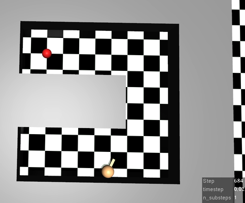
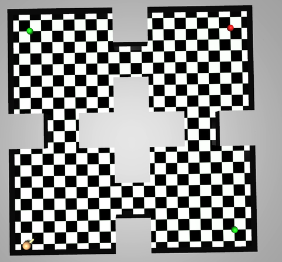
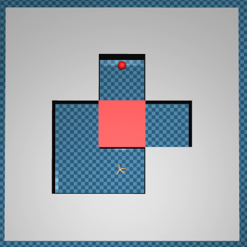
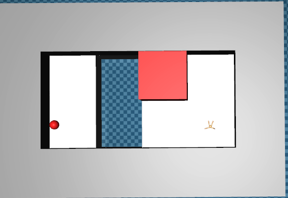
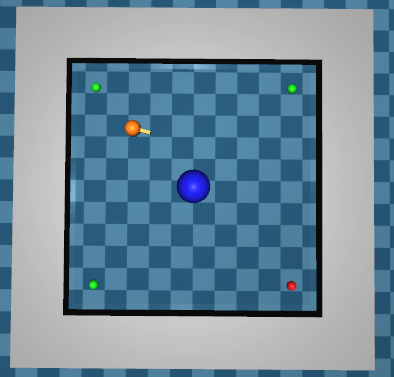

# mujoco-maze

Some maze environments for reinforcement learning(RL) using [mujoco-py] and
[openai gym][gym].

Thankfully, this project is based on the code from  [rllab] and [tensorflow/models][models].

## Environments

- PointUMaze/AntUmaze

  
  - PointUMaze-v0/AntUMaze-v0 (Distance-based Reward)
  - PointUmaze-v1/AntUMaze-v1 (Goal-based Reward i.e., 1.0 or -ε)

- Point4Rooms/Ant4Rooms

  
  - Point4Rooms-v0/Ant4Rooms-v0 (Distance-based Reward)
  - Point4Rooms-v1/Ant4Rooms-v1 (Goal-based Reward)
  - Point4Rooms-v2/Ant4Rooms-v2 (Multiple Goals (0.5 pt or 1.0 pt))

- PointPush/AntPush

  
  - PointPush-v0/AntPush-v0 (Distance-based Reward)
  - PointPush-v1/AntPush-v1 (Goal-based Reward)

- PointFall/AntFall

  
  - PointFall-v0/AntFall-v0 (Distance-based Reward)
  - PointFall-v1/AntFall-v1 (Goal-based Reward)

- PointBilliard

  
  - PointBilliard-v0 (Distance-based Reward)
  - PointBilliard-v1 (Goal-based Reward)
  - PointBilliard-v2 (Multiple Goals (0.5 pt or 1.0 pt))

## Warning
This project has some other environments (e.g., reacher, and swimmer)
but if they are not on README, they are work in progress and
not tested well.

## License
This project is licensed under Apache License, Version 2.0
([LICENSE-APACHE](LICENSE) or http://www.apache.org/licenses/LICENSE-2.0).

[gym]: https://github.com/openai/gym
[models]: https://github.com/tensorflow/models/tree/master/research/efficient-hrl
[mujoco-py]: https://github.com/openai/mujoco-py
[rllab]: https://github.com/rll/rllab
